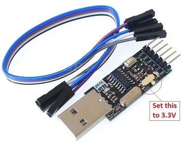
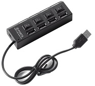

# STM8S103F3P6-development-board

*Updating this repo is in progress*

This repository is for collecting "C" programs (COSMIC) that can be used to program the STM8S103F3P6 development board as seen in the picture above.   
The STM8S103F3P6 is a 20 pin PIC microcontroller development board with 16 GPIO pins. It is cheap, quite powerful and easily available. You can program it in "C" (Cosmic) using an IDE called "STVD" and hex programmer called "STVP" - All of which you can download, install amd use for free on your win10 PC. 
  

Please note:
 - The following "C" programs are stored in folder "CODE/ZST_Workspce_FOLDER" of this repository  
   - STM8S_blink.c  
   - STM8S_uart.c
   - STM8S_adc.c 	 	 
   - YX5300_MP3_Player
 - When you buy this board, you only get the blue coloured development board as seen in the picture above without the header pins.  _**N.B. You will need to buy some header pins and solder them yourself before you can use the board**_.
 - To program the STM8S103, you also need a "ST-Link V2" USB device which connects to the boards 4 upright pins via a 4 wire dupont harness. See below for more information about this programming/debugging device 
 - If you want to use the UART on the development board and see the data on your PC (Perhaps using termite?), you also need a "USB to TTL" serial adaptor which connects to the board's 3 UART pins (Gnd.TX and RX). See below for more information about this USB to TTL Serial adaptor. 
 - There are 2 ways to supply regulated 5V to this dev board. 
   - Via the supplied micro USB connector (N.B. the data pins are NOT connected - you can only power the board theough this USB port.
   - Via the "ST-Link V2" USB Device  - This technique works fine as long as you are not powering anything else from the development board.
   
   

# Development Board Schematic information

The Schematic for this board is pictured above and it has the following components:
 - Micro USB Connector  - used to supply power to the board only
 - Reset button         - Resets the microcontroller 
 - "Poweron" LED        - This LED is always on when power is applied to the board (annoyingly bright !!)
 - "Signal" LED         - This LED is connected to pin B5 - to light the LED, you need to output a low to sink current.
 - 20 "Lower" pins      - It is usual to solder the 20 header pins below the board. This means you can plug the development board into a breadboard
 - 4  "Upper" pins      - It is usual to solder these 4 pins upwards. This means that while the development board is plugged into a breadboard, you can easily access these 4 pins to attach the "ST-Link V2" USB device. 

# "ST-LINK V2" device

If you want to program the board as per these examples, you will also need a "ST-LINK V2" USB device like the blue one you see in the picture above - If you haven't already got one, make sure you buy it at the same time as you buy a STM8S103F3P6 Development board.  
You will be using the pin connectino listed below. Annoyingly, the connection sequence varies between the ST-LINK V2 and the development board i.e. Make sure you compare the picture above with the first picture at the top, and use the connection matrix below to connect the two together

 - SWDIO (pin2)    -> SWIM
 - gnd   (pin4)    -> Gnd
 - SWCLK (pin6)    -> NRST
 - 3.3V  (pin8)    -> 3.3V
 
This "ST-LINK V2" device is plugged into a PC's USB port and the 4 wire harness connects to 4 "upper" pins of the development board. Bear in mind that the harness is short, so consider using a cheap 4 port USB hub so that you can position the development board better - Ideally you want the board to be near you so you can easily see it and connect things to it.  Bear in mind that one of the programs is for sending serial data back to the PC. To see this serial data, from the UART pin, you will need a TTL USB dongle and this would use another USB port. 

# "TTL USB Serial adaptor" device

If you want to test the UART capability of the development board, be aware you will need a "USB to TTL" serial adaptor like the one you see above.
N.B.  Make sure it is switchable and you set it to 3.3V.  

# Other useful items - 4 port hub, breadboard, dupont cables and electronic components
Just a reminder of other things that you could get. A cheap 4 port hub with a decently long lead will enable you to place the development board in easy reach on your desk.
You could also buy more than just a breadboard from a well known commerce site beginning with "E" i.e. Look for a complete kit of electronic parts which include lots of useful components as well as a breadboard                                                     
 
 
 

# How to get familiar with this board
- There are series of excellent blogs and tutorials out there. Here are a few of them

  - Generic STM8S103 breakout board
    - https://tenbaht.github.io/sduino/hardware/stm8blue/
  - STARTING STM8 MICROCONTROLLERS
    - http://embedded-lab.com/blog/starting-stm8-microcontrollers/
  - Getting Started with STM8S using STVD and Cosmic C Compilerck
    - https://circuitdigest.com/microcontroller-projects/getting-started-with-stm8s-using-stvd-and-cosmic-c-compiler
  - Blue-pill STM32 Programming Using ST-LINK V2 Dongle
    - https://www.youtube.com/watch?v=KgR3uM21y7o
  - GPIO Functions on STM8S using Cosmic C and SPL – Blinking and Controlling LED with Push Button
    - https://circuitdigest.com/microcontroller-projects/gpio-functions-on-stm8s-using-cosmic-c-and-spl-blinking-led-with-push-button
  - ADC on STM8S using Cosmic C Compiler – Reading Multiple ADC Values and Displaying on LCD
    - https://circuitdigest.com/microcontroller-projects/adc-on-stm8s-using-c-compiler-reading-multiple-adc-values-and-displaying-on-lcd
  - Getting Started with STM8 Microcontrollers
    - https://maker.pro/custom/tutorial/getting-started-with-stm8-microcontrollers

# How to Program the STM8S103F3P6 development board
 - On your PC, 

   - Highlight which project you want to use by right clikcing the project name and setting as the "active" project 
   - Press "Build" -> "Rebuld All" (check that there are no errors)
   - Press the "Programmer" button and after about 4 seconds, a window will be displayed. Press "start" to program your device

# Tips and tricks - Things you have to do
 - In your PC:
   - Remember you have to download and install 4 things into your Win10 PC 
     - The COSMIC compiler is downloaded from the COSMIC website 
     - The STVD software (IDE) is downloaded from the Microchip website.  
     - The STVP software (it controls the "ST-Link V2") is downloaded from the Microchip website.  
     - The repository zip file from here
       - Download the repository zip file to your PC and unzip it.
       - In the unzipped folder, Navigate through fodler "CODE" and copy the entire folder called "ZST_Workspace_FOLDER" to your PC e.g. make it "C:\ZST_WORKSPACE_FOLDER"
       - Execute STVD and open the workspace file called "C:\ZST_WORKSPACE_FOLDER\ZST_Workspace.stw". When this completes, you will see that the 4 projects are installed. 
   - Replace C:\Program Files (x86)\STMicroelectronics\st_toolset\stvp\tools.cnf. (N.B. You will find the file in the folder) 
    This is to stop STVD crashing when you press "programmer" 

   - Right click the "stvdebug.exe" program in "C:\Program Files (x86)\STMicroelectronics\st_toolset\stvd\" and set the compatability mode to be "Windows XP SP 3".
   This is to remove the error that says "no access to file default.wed".
 
 - When you are executing STVD in your PC
   - Highlight the workspace file (e.g. "zst_workspace"), right click and press "Settings" to display the "Settings" window. Change the following and press "OK" 
    - Change "Settings for" to "Debug"   (top left) and then select tab "C Compiler" - Change "C language" to default   
    - Change "Settings for" to "Release" (top left) and then select tab "C Compiler" - Change "C language" to default  
    - When you have to, set the location of the C compiler to the default place where you loaded the COSMIC compiler e.g. "C:\Program Files (x86)\COSMIC\FSE_Compilers\CXSTM8"
    - When you want to program the chip, set the "program memory" file to the appropriate "S19" file which is in folder "Debug"
